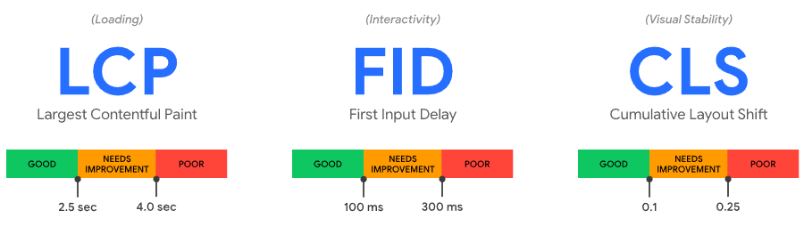
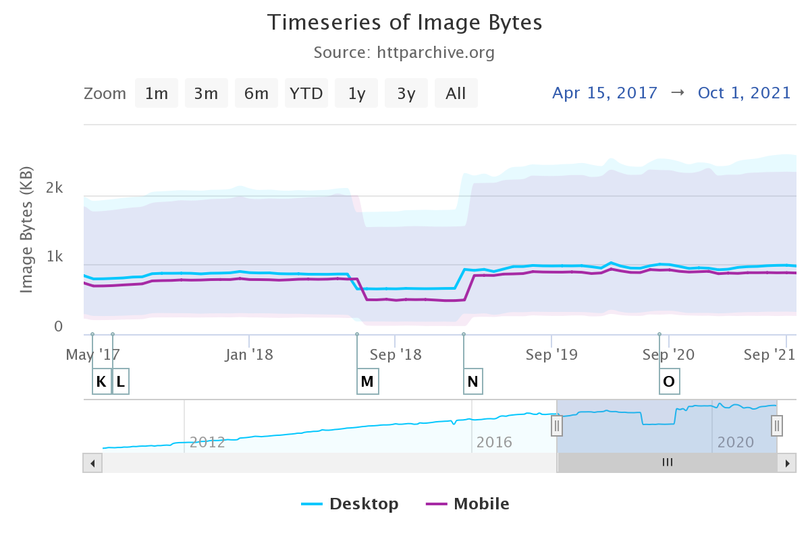

<!-- .slide: data-background="./images/hero_bg.jpg" -->
<h1 class="title dark-background">103 Early Hints <br><span class="translucent">at Shopify</span></h1>
<h2 class="subtitle">Sia Karamalegos</h2>

---

<!-- .slide: data-background="./images/pancakes.jpg" -->

---

## hi, i'm sia

[sia.codes](https://sia.codes/)


---

<!-- .slide: data-background="./images/water-guns.jpg" -->
<h1 class="dark-background">
  <span class="highlighter"> Preload is a footgun </span>
</h1>

---

<!-- .slide: data-background="./images/water-balloons.jpg" -->
<h1 class="dark-background">
  <span class="highlighter"> Early hints preload is a footcannon </span>
</h1>

---


<small>[Moving towards a faster web](https://blog.chromium.org/2019/11/moving-towards-faster-web.html)</small>

---

The internet consumes 416.2 TWh of electricity per year. A 10% savings would be equivalent to:

- 6.2 million fewer cars on the road 🚗 <!-- .element: class="fragment fade-in-then-semi-out" -->
- 32 billion less pounds of coal being burned 💨 <!-- .element: class="fragment fade-in-then-semi-out" -->
- 486 million tree seedlings grown for 10 years 🌳 <!-- .element: class="fragment fade-in-then-semi-out" -->

<small>[How is your website impacting the planet?](https://www.websitecarbon.com/), [Greenhouse Gas Equivalencies Calculator](https://www.epa.gov/energy/greenhouse-gas-equivalencies-calculator)</small>

Note: Most of the energy is consumed by the network and data center, not users' devices.

---

# 📈 Metrics 📈

---

> When optimizing for speed, <br>**user experience** should always <br>be your primary metric.

---

## User experience

1. When can I see the page? <!-- .element: class="fragment fade-in-then-semi-out" -->
2. When can I interact with it? <!-- .element: class="fragment fade-in-then-semi-out" -->
3. Does it respond to my interactions? <!-- .element: class="fragment fade-in-then-semi-out" -->
4. Is it delightful? <!-- .element: class="fragment fade-in-then-semi-out" -->

---

## Core Web Vitals



<small>[Web Vitals](https://web.dev/vitals/), [The Science Behind Web Vitals](https://blog.chromium.org/2020/05/the-science-behind-web-vitals.html)</small>

Note: Target is 75% of loads. "Core Web Vitals are the subset of Web Vitals that apply to all web pages, should be measured by all site owners, and will be surfaced across all Google tools. Each of the Core Web Vitals represents a distinct facet of the user experience, is measurable in the field, and reflects the real-world experience of a critical user-centric outcome." Note modifications over time to improve.

---

## New metric!

**Interaction to Next Paint** (INP): new, experimental metric that assesses how fast a page responds to user input

- Visual feedback is important<!-- .element: class="fragment fade-in" -->
- Measures overall interaction latency<!-- .element: class="fragment fade-in" -->
- Duration from user interaction until next frame is presented after event handlers executed<!-- .element: class="fragment fade-in" -->
- "Good" is currently < 200 ms<!-- .element: class="fragment fade-in" -->
- Impacted by too much JS, other non-JS work on the main thread running concurrently with user interactions<!-- .element: class="fragment fade-in" -->

<small>[Interaction to Next Paint (INP)](https://web.dev/inp/)</small>

Note: measures the worst interaction when < 50 or the 98th percentile

---

## New metric under evaluation

_Provide feedback now!_

- [Smoothness/animation metric](https://web.dev/smoothness/)

---

<h1 style="font-size:2.4em;"> 🧪 Test Environments 🧪 </h1>

---

## Testing Environments

<br>

<table class="fixed-two-column" id="invisible-gridlines">
  <thead>
    <tr>
      <th>Lab/Synthetic</th>
      <th>Field/Real User Monitoring (RUM)</th>
    </tr>
  </thead>
  <tbody>
    <tr>
      <td>
        <ul class="plus-minus" style="display:inline;">
          <li class="plus">Controlled environment</li>
          <li class="plus">Predefined network and device settings</li>
          <li class="plus">Reproducible for better performance debugging</li>
          <li class="minus">May not capture real-world bottlenecks</li>
        </ul>
      </td>
      <td>
        <ul class="plus-minus" style="display:inline;">
          <li class="plus">Performance data from <strong>real user page loads</strong> and interactions</li>
          <li class="minus">Limited data and performance debugging capability</li>
      </td>
    </tr>
  </tbody>
</table>

---



<small>[httparchive.org](https://httparchive.org), October 2021</small>

---

---

## Cheatsheet

- ✅ SVG: logos and icons <!-- .element: class="fragment fade-in-then-semi-out no-bullet" -->
- ❌ GIF: don't. use jpg for a still or video for animation. <!-- .element: class="fragment fade-in-then-semi-out no-bullet" -->
- ✅ PNG: photo-like images with transparency <!-- .element: class="fragment fade-in-then-semi-out no-bullet" -->
- ✅ JPG: photo-like images with no transparency <!-- .element: class="fragment fade-in-then-semi-out no-bullet" -->
- ✅ WEBP: smaller, but need to serve fallbacks <!-- .element: class="fragment fade-in-then-semi-out no-bullet" -->
- ✅ AVIF: EVEN SMALLER, but need to serve fallbacks <!-- .element: class="fragment fade-in-then-semi-out no-bullet" -->

<small>[Responsive Doggos Demo](https://projects.sia.codes/responsive-images-demo/)</small>

Note: Raster file formats are really just different compression methods. **SVG**: Can style and animate with CSS or make basic edits in XML. **GIF**: huge file sizes for animation, use video instead. svg or jpg are better for stills. Twitter converts GIF to video. **PNG**: Use jpg if don't need transparency. **JPG**: much better compression algos.

---

## 103 Early Hints

> 103s are served to clients while a 200 OK (or error) response is being prepared (the so-called “server think time”), and contain hints on which assets will likely be needed to fully render the web page.

<small>[Early Hints: How Cloudflare Can Improve Website Load Times by 30%](https://blog.cloudflare.com/early-hints/), [Chrome Status: Feature: 103 Early Hints for Navigation](https://www.chromestatus.com/feature/5207422375297024)</small>

Note: "the page load could have been accelerated had the browser known, prior to receiving the full response, that the stylesheet and the four subsequent scripts will be needed to render the page. Early Hints avoids these issues by “hinting” (vs. push being dictatorial) to clients which assets they should load, allowing them to prioritize resource loads with more complete information about what they will likely need to render a page, what they have cached, and other heuristics."

---


<small>https://twitter.com/colinbendell/status/1539322190541295616</small>

---

## Priority Hints

```html
<!-- Manage in-viewport priorities -->


<ul class="carousel">
  
  
  
  
</ul>

<!-- Initiate an early fetch for a resource, but also deprioritize it -->
<link rel="preload" href="/js/script.js" as="script" importance="low" />
```

<small>[Optimizing resource loading with Priority Hints](https://web.dev/priority-hints/)</small>

---


<small>Original art by [Jimmie Durhan](https://hirshhorn.si.edu/explore/jimmie-durham-still-life-spirit-xitle/), please forgive the meme I created over it</small>

---

<!-- .slide: data-background="./images/hero_bg.jpg" -->
<h1 class="title dark-background">Thanks!</h1>
Slides, resources, and more at <a href="https://sia.codes" class="dark-background">sia.codes</a>

---

## Credits

- Pancake image: Photo by <a href="https://unsplash.com/@amysaysamy?utm_source=unsplash&utm_medium=referral&utm_content=creditCopyText">Amy Flak</a> on <a href="https://unsplash.com/?utm_source=unsplash&utm_medium=referral&utm_content=creditCopyText">Unsplash</a>
- Water balloons image: Photo by <a href="https://unsplash.com/@tcooper86?utm_source=unsplash&utm_medium=referral&utm_content=creditCopyText">Tim Cooper</a> on <a href="https://unsplash.com/?utm_source=unsplash&utm_medium=referral&utm_content=creditCopyText">Unsplash</a>
-
