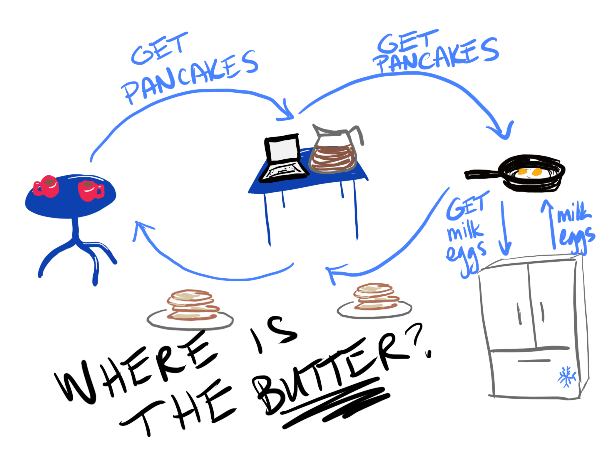
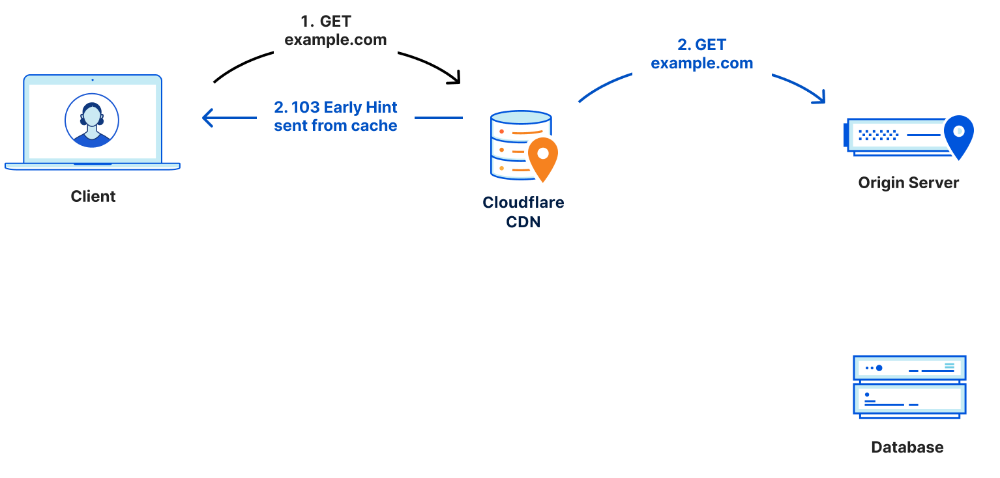
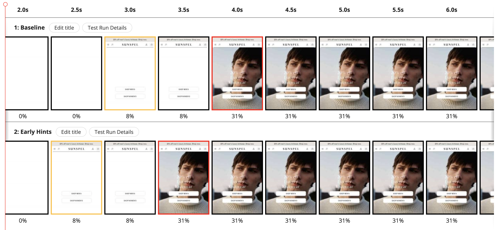

<!-- .slide: data-background="./images/froot-loops.jpg", class="filter-dark"-->
<h1 class="title highlighter dark-background">103 Early Hints <br><span class="translucent">at Shopify</span></h1>
<h2 class=" highlighter dark-background">Sia Karamalegos</h2>

---

<!-- .slide: data-background="./images/pancakes.jpg" -->

---

## hi, i'm sia

[sia.codes](https://sia.codes/)


---


---


---


---


---


---


---


---



---


---


---


---


---


---


---


---

## Where's the inefficiency?

---


---


---

## HTTP2 Server Push

- ✅ Proactively send resources <!-- .element: class="fragment fade-in-then-semi-out no-bullet" -->
- ❌ Caching got more complicated <!-- .element: class="fragment fade-in-then-semi-out no-bullet" -->
- ❌ Realizing positive results was hard <!-- .element: class="fragment fade-in-then-semi-out no-bullet" -->

---


---


---

## 103 Early Hints

- ✅ Only send hints, and let the browser decide <!-- .element: class="fragment fade-in-then-semi-out no-bullet" -->
- ✅ Don't make caching harder <!-- .element: class="fragment fade-in-then-semi-out no-bullet" -->
- 🧐 Results are still early stage <!-- .element: class="fragment fade-in-then-semi-out no-bullet" -->

---


---


---


---



---


---


---


<small>From <a href="https://blog.cloudflare.com/early-hints-performance/">Early Hints update: How Cloudflare, Google, and Shopify are working together to build a faster Internet for everyone</a></small>

---

## 103 Early Hints: the details

- Sends HTTP status code 103 <!-- .element: class="fragment fade-in-then-semi-out" -->
- Content/hints are in the HTTP header <!-- .element: class="fragment fade-in-then-semi-out" -->

---

<div style="display:flex;justify-content:space-between">
  
  
</div>

<small>From <a href="https://developer.chrome.com/blog/early-hints/">Faster page loads using server think-time with Early Hints</a></small>

---

> Cloudflare sits within 50 milliseconds of 95% of the Internet-connected population globally.

---

## Syntax

```
HTTP/1.1 103 Early Hints
Link: <https://example.com>; rel="preconnect"
Link: </style.css>; rel=preload; as=style
Link: </script.js>; rel=preload; as=script
```

Note: Goal today is to explain the concepts. Details on how to set this up are better served with docs and tutorials from Cloudflare and Fastly. If you're considering rolling your own, talk to some of those folks about the common pitfalls.

---

## Resource Hints Review

Early hints can be sent for <br/>
`preconnect` and `preload`.

---

```html
<!-- Preconnect -->
<link rel="preconnect" href="https://cdn.shopify.com">
```

Note: All modern browsers except Firefox

---

```html
<!-- Preload -->
<link
  href="//cdn.shopify.com/.../ShopifySans-Regular.woff2"
  rel="preload" as="font" type="font/woff2" crossorigin="true">
```

Note: All modern browsers

---

<!-- .slide: data-background="./images/fruit_juice.jpg", class="filter-dark"-->
# When to consider Early Hints <!-- .element: class="dark-background highlighter"-->

---

> When a buyer visits a Shopify website, if that **first page experience** is 10% faster, on average there is a 7% increase in conversion.

---

## Should I consider Early Hints?

- ✅ First impressions are important for conversion (use on top landing pages) <!-- .element: class="fragment fade-in-then-semi-out no-bullet" -->
- ✅ Server has to do work before sending the HTML <!-- .element: class="fragment fade-in-then-semi-out no-bullet" -->
- ❌ Server can immediately send the HTML <!-- .element: class="fragment fade-in-then-semi-out no-bullet" -->
- ✅ Server is farther from user than edge/CDN server <!-- .element: class="fragment fade-in-then-semi-out no-bullet" -->
- ✅ Traffic is high enough that the edge/CDN server will likely have Early Hints cached <!-- .element: class="fragment fade-in-then-semi-out no-bullet" -->
- ✅ Use on resources that do not change often <!-- .element: class="fragment fade-in-then-semi-out no-bullet" -->

---

<!-- .slide: data-background="./images/teamwork.jpg", class="filter-dark"-->
# Teamwork <!-- .element: class="dark-background highlighter"-->

---


Note: Colin Bendell at Shopify, Alex Krivit at Cloudflare and Kenji Baheeux + Kenichi Ishibashi at Chrome

---


Note: Colin Bendell at Shopify, Alex Krivit at Cloudflare and Kenji Baheeux at Chrome

---

<!-- .slide: data-background="./images/oatmeal-fruit.jpg", class="filter-dark"-->
# Results <!-- .element: class="dark-background highlighter"-->

---

## Preconnect

```
HTTP/1.1 103 Early Hints
Link: <https://cdn.shopify.com>; rel="preconnect"
Link: <https://cdn.shopify.com>; crossorigin; rel="preconnect"
```

---

## Largest Contentful Paint


Note: BFCM 2021 test. LCP improved across all regions and operating systems on Chrome browsers when an early hint was used to preconnect to our CDN domain. ~500ms improvement in median LCP

---

## Largest Contentful Paint


---


---

# 🤔

Note: take a step back and realize we wouldn't need this if we didn't have a separate CDN domain - so we're using EH to accommodate for a less-than-ideal situation due to legacy architecture. Under HTTP1, domain sharding was a better way to serve assets faster due to the limited number of concurrent connections ~6. Can't instantly switch each time a new HTTP version comes out.

---

## Preload

```
HTTP/1.1 103 Early Hints
Link: <font1.woff2>; rel=preload; as=font; crossorigin...
Link: <font3.woff2>; rel=preload; as=font; crossorigin...
Link: <script.js>; rel=preload; as=script; type=text/javascript
Link: <main.js>; rel=preload; as=script; type=text/javascript
Link: <theme.css>; rel=preload; as=style;
```

---

## Shopify themes use Liquid for templating

- HTML templating language
- Similar to Nunjucks, HAML, Handlebars, Pug, etc.
- Can access data directly in Liquid for SSR
- See layout (wrapper) [example](https://github.com/Shopify-Web-Perf-Team-Internal/perf-shopify-theme/blob/main/layout/theme.liquid) for context

---

## Early Hints via Liquid

```liquid
{{ 'font.woff2'
  | asset_url
  | preload_tag:
      as: 'font',
      type: 'font/woff2',
      crossorigin: true
}}

{{ 'script.js' | asset_url | preload_tag: as: 'script' }}

{{ 'style.css' | asset_url | stylesheet_tag: preload: true }}
```

Note: Liquid: piping into next filter, additional params after filter. Stores can only access EH using Liquid, and only to files on our CDN. Will create both preload tags and EH's.

---

```liquid
{{
  product.featured_image
    | image_url: width: 2 000
    | image_tag:
        preload: true,
        widths: 50, 80, 90, 100, 120, 160, 200, 300, 400, 500,
          600, 700, 800, 1000, 1200, 1500, 1800, 2000
}}
```

Note: Also an example of accessing data object directly in Liquid. Can anyone imagine what might go wrong here???

---

```html

```

Note: Image srcsets as preload early hints are not yet working - still working on implementation details.

---


---

<!-- .slide: data-background="./images/shame.jpg" -->

---

⚠️ Beware of making your headers too large!

Note: Also consider fetchpriority instead. Where were we? Oh yeah...

---

<!-- .slide: data-background="./images/toast-egg.jpg", class="filter-dark"-->
# ...Results <!-- .element: class="dark-background highlighter"-->

---

<!-- .slide: data-background="./images/rum.jpg", class="filter-dark" -->
# RUM is hard <!-- .element: class="dark-background highlighter"-->

Note: Our preconnect tests were a true A/B test. But for preload, in true engineering style, we might have over optimized the laziness factor and tried to do a before/after test.

---


Note: So what we actually measured was a TTFB degradation unrelated to EH. Which leads me to the next part of the presentation...

---

## How I blew through my WebPageTest Pro budget in 2 days

---

## 1.2% improvement in p50 LCP

- 16 different merchant websites
- Index, collection, and product pages
- High variation within each 9 runs
- Ranged from -15% to 21%

Note:  Etsy recently conducted an experiment using early hints and measured a 2.5% improvement in LCP for landing pages, based on preconnects and font preloads. They are evaluating other ways of implementing to early hints to maximize the performance gains. Wix tested preconnects and haven't found significant improvement with it yet.

---

## Preload is still a footgun.

---

## Without Early Hints


---

## With Early Hints 🦶🏻🔫


---



---

<!-- .slide: data-background="./images/cappuccino.jpg", class="filter-dark" -->
# Conclusion <!-- .element: class="dark-background highlighter"-->

---

## Conclusion

- ✅ Early Hints is more promising than HTTP2 Server Push <!-- .element: class="fragment fade-in-then-semi-out no-bullet" -->
- ✅ Preconnect showed promising results <!-- .element: class="fragment fade-in-then-semi-out no-bullet" -->
- ⚠️ Preload is trickier and needs case-by-case testing <!-- .element: class="fragment fade-in-then-semi-out no-bullet" -->
- ✅ Teamwork makes the dream work <!-- .element: class="fragment fade-in-then-semi-out no-bullet" -->
- 🧈 Butter hints are better than no butter hints <!-- .element: class="fragment fade-in-then-semi-out no-bullet" -->

---

<!-- .slide: data-background="./images/gudetama.png", class="filter-dark" -->
<div class="highlighter dark-background" style="padding: 40px 0">
  <h1 class="title dark-background">Thanks!</h1>
  <h2 class="dark-background">Slides, resources, and more at <a href="https://sia.codes">sia.codes</a></h2>
</div>

---

## Photo Credits

<small>
- Pancake image: Photo by <a href="https://unsplash.com/@amysaysamy?utm_source=unsplash&utm_medium=referral&utm_content=creditCopyText">Amy Flak</a> on <a href="https://unsplash.com/?utm_source=unsplash&utm_medium=referral&utm_content=creditCopyText">Unsplash</a>
- Water balloons image: Photo by <a href="https://unsplash.com/@tcooper86?utm_source=unsplash&utm_medium=referral&utm_content=creditCopyText">Tim Cooper</a> on <a href="https://unsplash.com/?utm_source=unsplash&utm_medium=referral&utm_content=creditCopyText">Unsplash</a>
- Froot Loops image: Photo by <a href="https://unsplash.com/@etiennegirardet?utm_source=unsplash&utm_medium=referral&utm_content=creditCopyText">Etienne Girardet</a> on <a href="https://unsplash.com/?utm_source=unsplash&utm_medium=referral&utm_content=creditCopyText">Unsplash</a>
- Oatmeal with fruit image: Photo by <a href="https://unsplash.com/@brookelark?utm_source=unsplash&utm_medium=referral&utm_content=creditCopyText">Brooke Lark</a> on <a href="https://unsplash.com/?utm_source=unsplash&utm_medium=referral&utm_content=creditCopyText">Unsplash</a>
- Toast and egg image: Photo by <a href="https://unsplash.com/@shootdelicious?utm_source=unsplash&utm_medium=referral&utm_content=creditCopyText">Eiliv Aceron</a> on <a href="https://unsplash.com/?utm_source=unsplash&utm_medium=referral&utm_content=creditCopyText">Unsplash</a>
- Rum image: Photo by <a href="https://unsplash.com/@annoand?utm_source=unsplash&utm_medium=referral&utm_content=creditCopyText">Anders Nord</a> on <a href="https://unsplash.com/s/photos/rum?utm_source=unsplash&utm_medium=referral&utm_content=creditCopyText">Unsplash</a>
- Little girl with hands over eyes: Photo by <a href="https://unsplash.com/@caleb_woods?utm_source=unsplash&utm_medium=referral&utm_content=creditCopyText">Caleb Woods</a> on <a href="https://unsplash.com/s/photos/shame?utm_source=unsplash&utm_medium=referral&utm_content=creditCopyText">Unsplash</a>
- Teamwork image: Photo by <a href="https://unsplash.com/@hannahbusing?utm_source=unsplash&utm_medium=referral&utm_content=creditCopyText">Hannah Busing</a> on <a href="https://unsplash.com/s/photos/team-work?utm_source=unsplash&utm_medium=referral&utm_content=creditCopyText">Unsplash</a>
- Cappuccino: Photo by <a href="https://unsplash.com/@jeztimms?utm_source=unsplash&utm_medium=referral&utm_content=creditCopyText">Jez Timms</a> on <a href="https://unsplash.com/?utm_source=unsplash&utm_medium=referral&utm_content=creditCopyText">Unsplash</a>
- Fruit and juice: Photo by <a href="https://unsplash.com/@brookelark?utm_source=unsplash&utm_medium=referral&utm_content=creditCopyText">Brooke Lark</a> on <a href="https://unsplash.com/s/photos/breakfast?utm_source=unsplash&utm_medium=referral&utm_content=creditCopyText">Unsplash</a>
- Water gun fight is licensed through Unsplash+
</small>

---

## Chrome CLI to disable Early Hints on WebPageTest

```
--disable-features=EarlyHintsPreloadForNavigation
```
