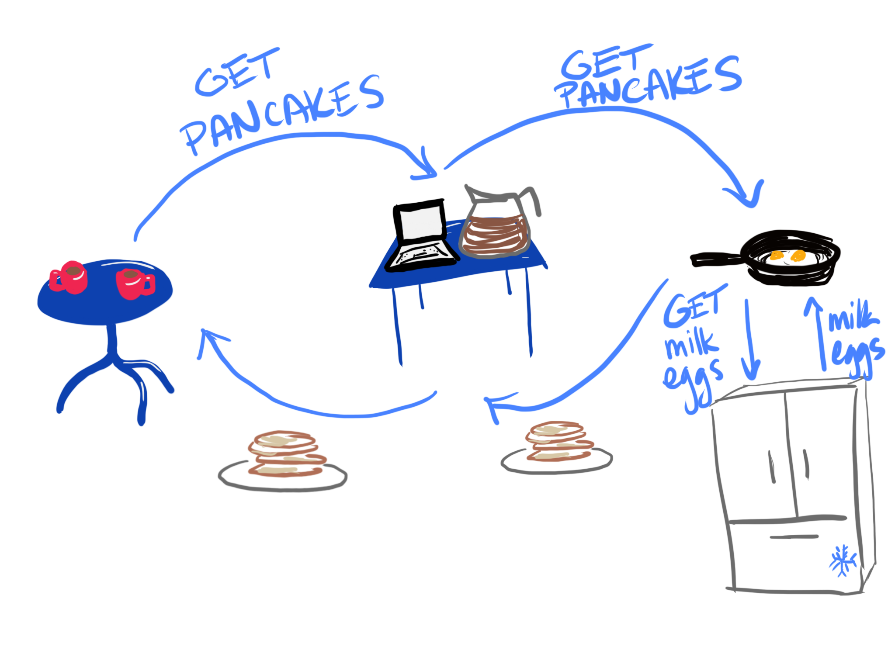
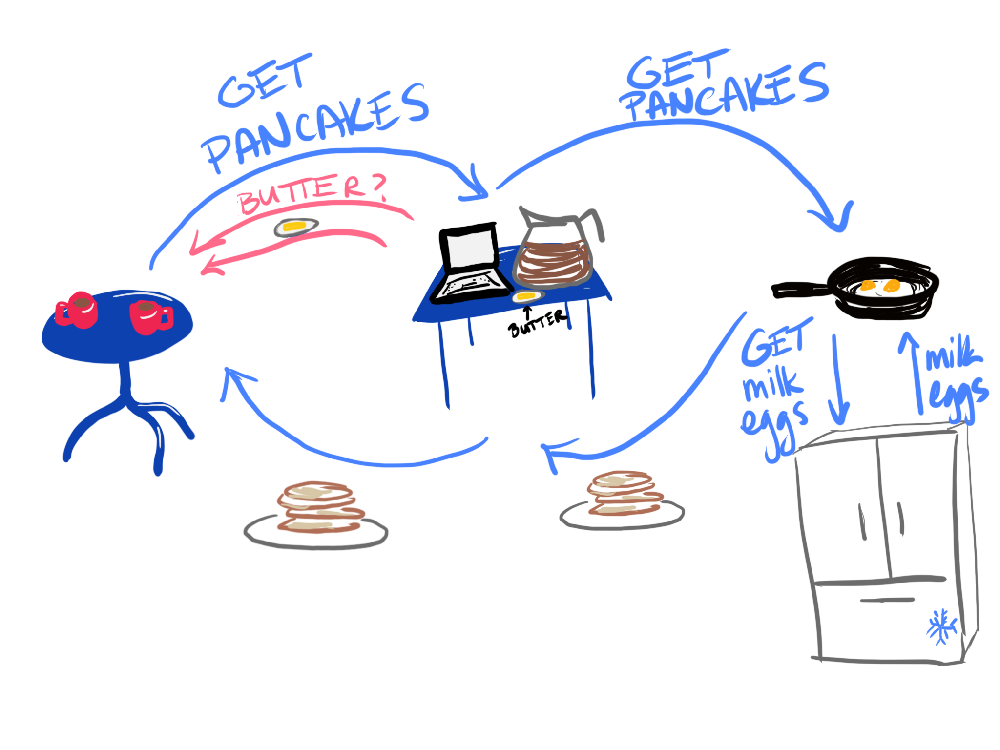
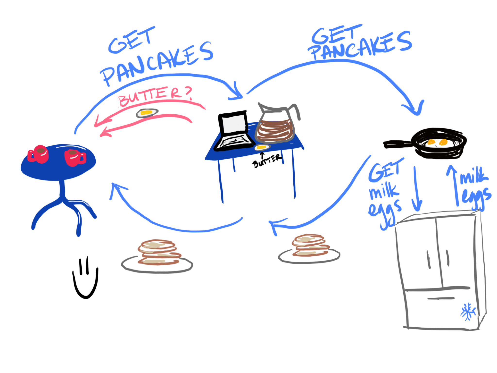

<!-- .slide: data-background="./images/froot-loops.jpg", class="filter-dark"-->
<h1 class="title highlighter dark-background">103 Early Hints <br><span class="translucent">at Shopify</span></h1>
<h2 class=" highlighter dark-background">Sia Karamalegos</h2>

---

<!-- .slide: data-background="./images/pancakes.jpg" -->

---


---


---


---


---


---


---



---


---


---


---


---


---


---


---



---



---

## hi, i'm sia

[sia.codes](https://sia.codes/)


---

## Where's the inefficiency?

---


Note: - Server wait time, Origin latency time

---

## HTTP2 Server Push

- ✅ Proactively send resources <!-- .element: class="fragment fade-in-then-semi-out no-bullet" -->
- ❌ Caching got more complicated <!-- .element: class="fragment fade-in-then-semi-out no-bullet" -->
- ❌ Realizing positive results was hard <!-- .element: class="fragment fade-in-then-semi-out no-bullet" -->

---

## 103 Early Hints

- ✅ Only send hints and let the browser decide <!-- .element: class="fragment fade-in-then-semi-out no-bullet" -->
- ✅ Don't make caching harder <!-- .element: class="fragment fade-in-then-semi-out no-bullet" -->
- 🧐 Results are still early stage <!-- .element: class="fragment fade-in-then-semi-out no-bullet" -->

---


---


---


---

```
HTTP/1.1 103 Early Hints
Link: <https://example.com>; rel="preconnect"
Link: </style.css>; rel=preload; as=style
Link: </script.js>; rel=preload; as=script
```

---

<!-- .slide: data-background="./images/oatmeal-fruit.jpg", class="filter-dark"-->
# Results <!-- .element: class="dark-background highlighter"-->

---

## Preconnect

```
HTTP/1.1 103 Early Hints
Link: <https://cdn.shopify.com>; rel="preconnect"
Link: <https://cdn.shopify.com>; crossorigin; rel="preconnect"
```

---

<!-- TODO: Add alts to all images -->


Note: BFCM 2021 test. LCP improved across all regions and operating systems on Chrome browsers when an early hint was used to preconnect to our CDN domain. ~500ms improvement in median LCP

---

# 🤔

Note: take a step back and realize we wouldn't need this if we didn't have a separate CDN domain - so we're using EH to accommodate for a less-than-ideal situation due to legacy architecture - which is totally a valid use case still but something to keep in mind

---

## Preload

```
HTTP/1.1 103 Early Hints
Link: <//cdn.shop.../assets/font1.woff2>; as=font; crossorigin; rel=preload; type=font/woff2
Link: <//cdn.shop.../assets/font3.woff2>; as=font; crossorigin; rel=preload; type=font/woff2
Link: <//cdn.shop.../files/script.js>; as=script; rel=preload; type=text/javascript
Link: <//cdn.shop.../assets/main.js>; as=script; rel=preload; type=text/javascript
Link: <//cdn.shop.../assets/theme.css>; as=style; rel=preload
```

---

## Early Hints via Liquid

```liquid
{{ 'font.woff2'
  | asset_url
  | preload_tag: as: 'font', type: 'font/woff2', crossorigin: true }}

{{ 'script.js' | asset_url | preload_tag: as: 'script' }}

{{ 'style.css' | asset_url | stylesheet_tag: preload: true }}
```

Note: Stores can only access EH using Liquid, and only to files on our CDN. Will create both preload tags and EH's.

---

```liquid
{{
  product.featured_image
    | image_url: width: 600
    | image_tag: preload: true, widths: 80, 90, 100, 120, 200, 400, 600, 800
}}
```

Note: Can anyone imagine what might go wrong here???

---


---

<!-- .slide: data-background="./images/shame.jpg" -->

---

⚠️ Beware of making your headers too large!

Note: where were we? Oh yeah...

---

<!-- .slide: data-background="./images/toast-egg.jpg", class="filter-dark"-->
# ...Results <!-- .element: class="dark-background highlighter"-->

---

<!-- .slide: data-background="./images/rum.jpg", class="filter-dark" -->
# RUM is hard <!-- .element: class="dark-background highlighter"-->

Note: Our preconnect tests were a true A/B test. But for preload, in true engineering style, we might have over optimized the laziness factor and tried to do a before/after test.

---


Note: So what we actually measured was a TTFB degradation unrelated to EH. Which leads me to the next part of the presentation...

---

## How I blew through my WebPageTest Pro budget in one week

---

results

---

<!-- .slide: data-background="./images/water-guns.jpg" -->
<h1 class="dark-background">
  <span class="highlighter"> Preload is a footgun </span>
</h1>

---

<!-- .slide: data-background="./images/water-balloons.jpg" -->
<h1 class="dark-background">
  <span class="highlighter"> Early hints preload is a footcannon </span>
</h1>

---


<small>Original art by [Jimmie Durhan](https://hirshhorn.si.edu/explore/jimmie-durham-still-life-spirit-xitle/), please forgive the meme I created over it</small>

---

<!-- .slide: data-background="./images/gudetama.png", class="filter-dark" -->
<div class="highlighter dark-background" style="padding: 40px 0">
  <h1 class="title dark-background">Thanks!</h1>
  <h2 class="dark-background">Slides, resources, and more at <a href="https://sia.codes">sia.codes</a></h2>
</div>

---

## Credits

- Pancake image: Photo by <a href="https://unsplash.com/@amysaysamy?utm_source=unsplash&utm_medium=referral&utm_content=creditCopyText">Amy Flak</a> on <a href="https://unsplash.com/?utm_source=unsplash&utm_medium=referral&utm_content=creditCopyText">Unsplash</a>
- Water balloons image: Photo by <a href="https://unsplash.com/@tcooper86?utm_source=unsplash&utm_medium=referral&utm_content=creditCopyText">Tim Cooper</a> on <a href="https://unsplash.com/?utm_source=unsplash&utm_medium=referral&utm_content=creditCopyText">Unsplash</a>
- Froot Loops image: Photo by <a href="https://unsplash.com/@etiennegirardet?utm_source=unsplash&utm_medium=referral&utm_content=creditCopyText">Etienne Girardet</a> on <a href="https://unsplash.com/?utm_source=unsplash&utm_medium=referral&utm_content=creditCopyText">Unsplash</a>
- Oatmeal with fruit image: Photo by <a href="https://unsplash.com/@brookelark?utm_source=unsplash&utm_medium=referral&utm_content=creditCopyText">Brooke Lark</a> on <a href="https://unsplash.com/?utm_source=unsplash&utm_medium=referral&utm_content=creditCopyText">Unsplash</a>
- Toast and egg image: Photo by <a href="https://unsplash.com/@shootdelicious?utm_source=unsplash&utm_medium=referral&utm_content=creditCopyText">Eiliv Aceron</a> on <a href="https://unsplash.com/?utm_source=unsplash&utm_medium=referral&utm_content=creditCopyText">Unsplash</a>
- Rum image: Photo by <a href="https://unsplash.com/@annoand?utm_source=unsplash&utm_medium=referral&utm_content=creditCopyText">Anders Nord</a> on <a href="https://unsplash.com/s/photos/rum?utm_source=unsplash&utm_medium=referral&utm_content=creditCopyText">Unsplash</a>
- Little girl with hands over eyes: Photo by <a href="https://unsplash.com/@caleb_woods?utm_source=unsplash&utm_medium=referral&utm_content=creditCopyText">Caleb Woods</a> on <a href="https://unsplash.com/s/photos/shame?utm_source=unsplash&utm_medium=referral&utm_content=creditCopyText">Unsplash</a>

- Water gun fight is licensed through Unsplash+

---

## Cheatsheet

- ✅ SVG: logos and icons <!-- .element: class="fragment fade-in-then-semi-out no-bullet" -->
- ❌ GIF: don't. use jpg for a still or video for animation. <!-- .element: class="fragment fade-in-then-semi-out no-bullet" -->
- ✅ PNG: photo-like images with transparency <!-- .element: class="fragment fade-in-then-semi-out no-bullet" -->
- ✅ JPG: photo-like images with no transparency <!-- .element: class="fragment fade-in-then-semi-out no-bullet" -->
- ✅ WEBP: smaller, but need to serve fallbacks <!-- .element: class="fragment fade-in-then-semi-out no-bullet" -->
- ✅ AVIF: EVEN SMALLER, but need to serve fallbacks <!-- .element: class="fragment fade-in-then-semi-out no-bullet" -->

<small>[Responsive Doggos Demo](https://projects.sia.codes/responsive-images-demo/)</small>

Note: Raster file formats are really just different compression methods. **SVG**: Can style and animate with CSS or make basic edits in XML. **GIF**: huge file sizes for animation, use video instead. svg or jpg are better for stills. Twitter converts GIF to video. **PNG**: Use jpg if don't need transparency. **JPG**: much better compression algos.
